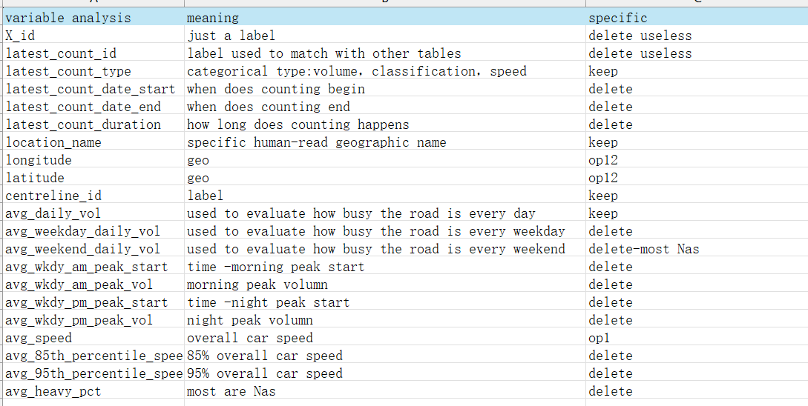

# about data cleaning:

1. chunk1:how i get the csv file from opendatatoronto

2. chunk2:i import the csv file and analysis the variable

3.chunk6,8: since data of volumn and speed is highly skewed, i change the band of color.

4. chunk12(op5): i changed the color of font to make it more obvious in table and easy to see whether the current number is above or below the mean.

