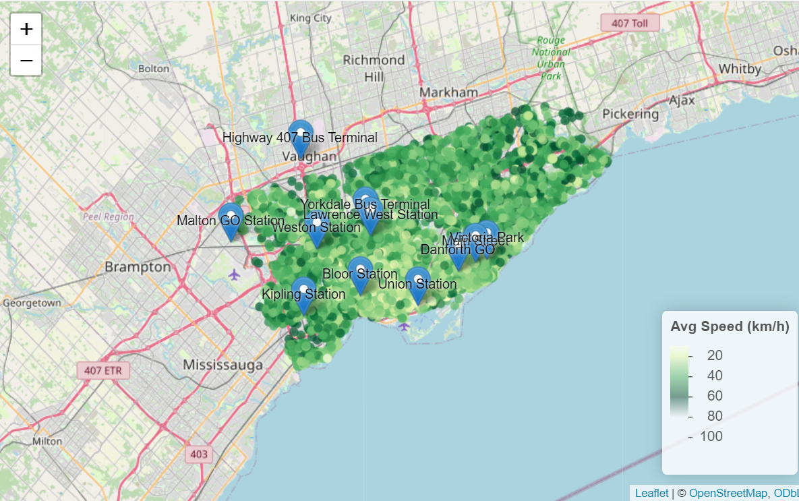
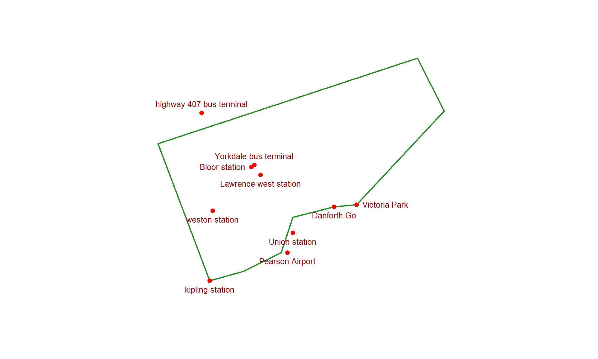
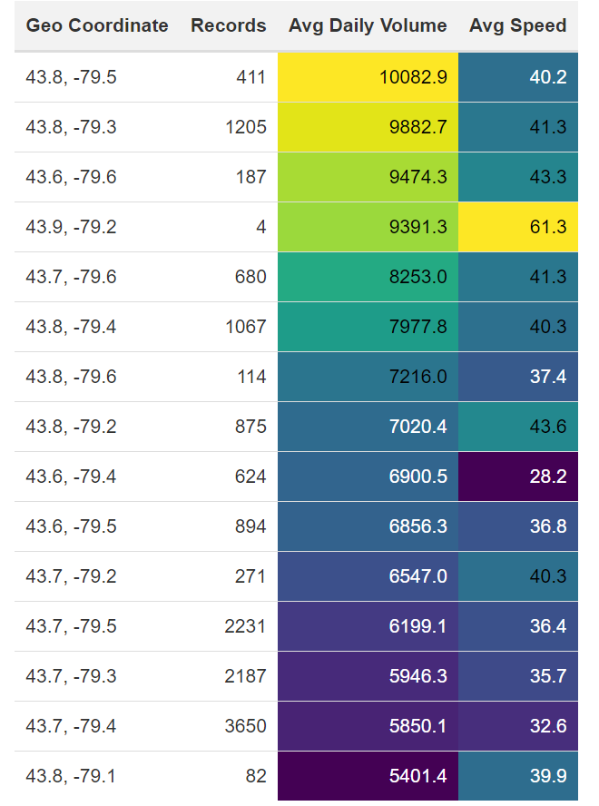

```{r, include=FALSE}
knitr::opts_chunk$set(results = 'asis',
                      echo = FALSE,
                      warning = FALSE,
                      tidy = FALSE,
                      message = FALSE,
                      fig.align = 'center',
                      out.width = "100%")
options(knitr.table.format = "html") 
```

```{r myplot, include=FALSE}
svg('myplot.svg')
plot(iris$Sepal.Length, iris$Sepal.Width)
dev.off()
```

These 4 visualizations shows the observation around the airport region which as a major traffic place with both vehicle volume and travel speeds.
```{r, include=FALSE}
knitr::write_bib(c('posterdown', 'rmarkdown','pagedown'), 'packages.bib')
```

{width=60%}

Figure 1(op1) presents a 2D kernel density plot, where brighter regions indicate higher observation counts. Obviously, the area surrounding the airport shows a clear concentration of activity.

{width=60%}

Figure 2(op1) illustrates average daily speed across Toronto. Speeds tend to decrease near the airport, maybe due to higher test frequency and heavier traffic volumes.

{width=60%}

Figure 3(op1) shows average daily traffic volume. As expected, arterial roads and the airport area experience higher vehicle density, matching well with real-world conditions.


{width=60%}

Figure 4(op2) highlights key access routes to the airport used by different communities. Overlaid with average speed data, it confirms slower traffic near the airport zone.

{width=100%}

Figure 5(op4) uses graph primitives to sketch the overall layout of the tested region and key station points.


{width=60%}


Figure 6(op5) is a conditionally formatted data table summarizing geographic coordinates, average speed, and volume. Color gradients help highlight which locations experience the most or least congestion.
